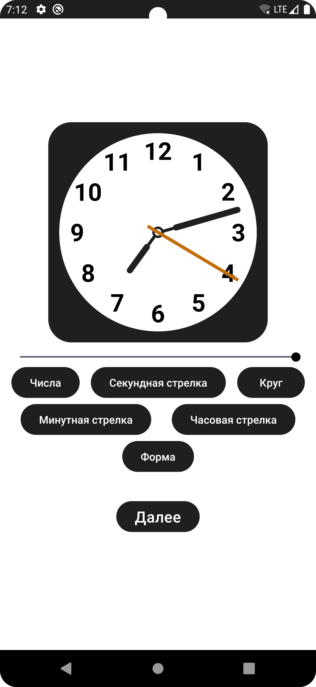
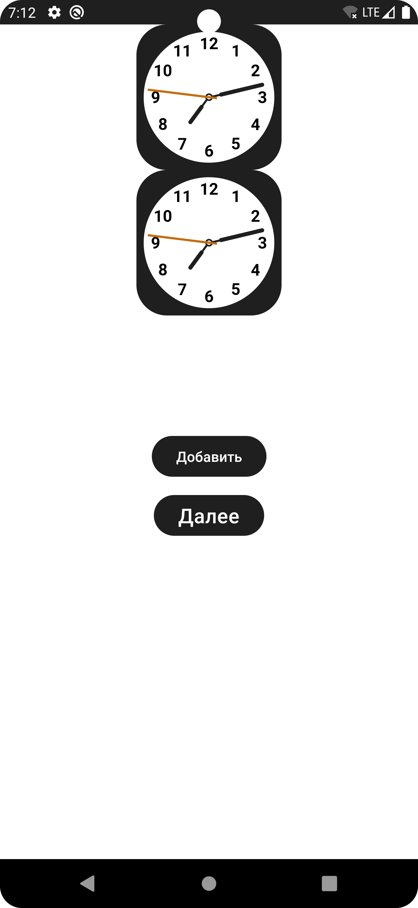
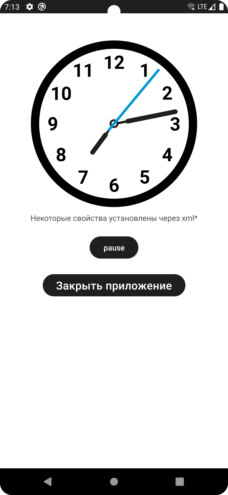

<h1>
  ClockView
</h1>

CustomView для отображения времени на стрелочных часах

## Основной функционал:

* Показ текущего времени
* Кастомизация
* Возможность ставить и снимать с паузы

## Разметка

> Vk [ruslan.itpro](https://vk.com/ruslan.itpro)&nbsp;&middot;&nbsp;
> GitHub [@versoIt](https://github.com/versoit)
